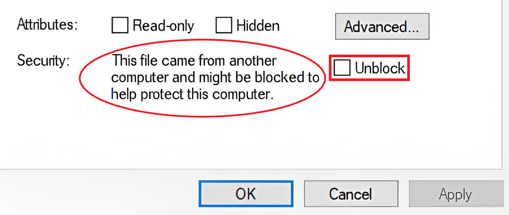
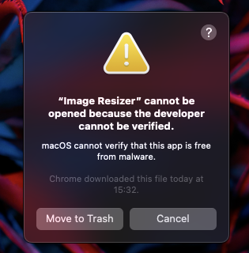
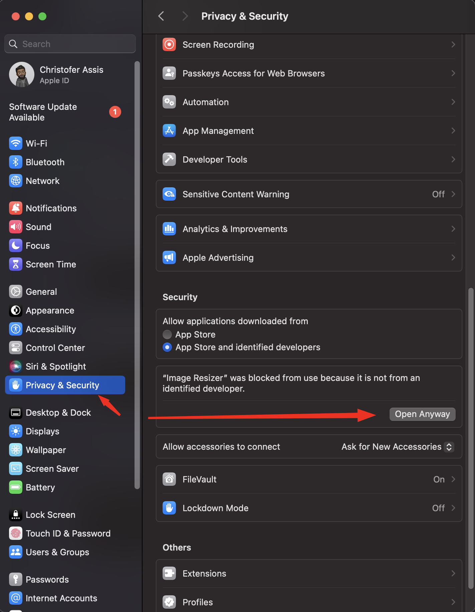

<h1>Image resizer </h1> 

  
    

## Overview

The Image Resizer is a user-friendly application designed to simplify the process of resizing images on your desktop. Whether you need to quickly adjust the dimensions of photos for a presentation, social media, or other purposes, this application provides a convenient and efficient solution.

## Table of Contents

- [Overview](#overview)
- [Table of Contents](#table-of-contents)
- [Key features](#key-features)
- [How to Use](#how-to-use)
- [Installation](#installation)
    - [On Windows](#on-windows)
    - [On MacOS](#on-macos)
- [Contributing to Image Resizer](#contributing-to-image-resizer)

## Key features

- ### Intuitive and simple User Interface
  The application features a clean and intuitive user interface, making it easy for users of all levels to navigate and utilize its features.

- ### Batch Resizing
  Efficiently resize multiple images at once. Save time by selecting an entire group of images to resize simultaneously.

## How to Use
1. **Open the App:** Launch the Image Resizer Desktop App on your computer;
2. **Select Images:** Choose the images you want to resize, either individually or as a batch;
3. **Set Dimensions:** Specify the desired dimensions;
4. **Resize:** Confirm and start the resizing process. When finished, the application automatically opens the folder where the images were saved.

## Installation

You just need to go to [releases](https://github.com/Chriszao/electron-resize-images/releases) section and select you OS platform, and download the binary. 
As it is a non-profit app made to help friends, this app does not have an `EV code signing certificate`, so your OS may accuse the app as malicious. To avoid this problem, follow the bellow steps:

#### On Windows

Before install the app, do the following: 

1. Right-click the installer;
2. Select “Properties”;
3. Check “Unblock”;
4. Click “OK”.

#### On MacOS

Maybe you will see this dialog:

1. Open your System Settings > Privacy & Security;
2. Scroll down until you find the app blocking, and click in "Open Anyway"

---

## Contributing to Image Resizer

To contribute to Image Resizer, follow these steps:

1. Clone this repo;
2. Create a branch: `git checkout -b <branch_name>`;
3. Make your changes and commit them: `git commit -m '<message_commit>'`;
4. Push to the original branch: `git push origin <project_name> main`;
5. Create the pull request;
6. 
Alternatively, see the GitHub documentation on [creating a pull request](https://help.github.com/en/github/collaborating-with-issues-and-pull-requests/creating-a-pull-request).

[Back to Top](#overview) ⬆️
